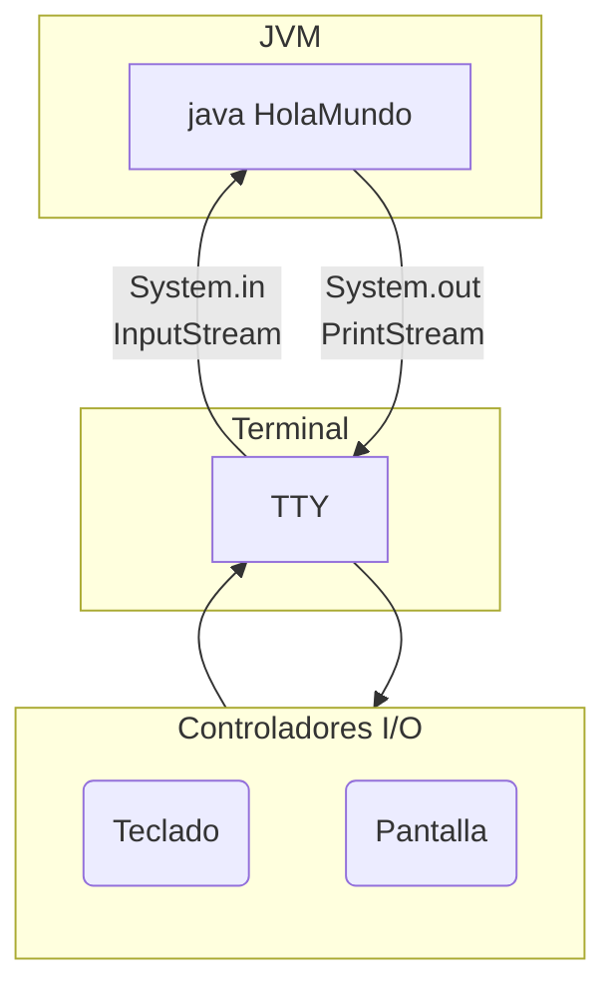

Abstract:  En este artículo nos haremos una introducción técnica y práctica al lenguaje de programación Java. 
<!--more-->

Java es el segundo lenguaje mas popular en el 2022<sup>[1][1]</sup> muy usado para aplicaciones para Android o aplicaciones web como Spring Framework.

## Un lenguaje compilado
Java es un lenguaje que nos permite crear programas. Escribimos las instrucciones de dicho programa en código fuente en archivos `.java` y luego el compilador `javac` los convierte en ejecutables [bytecode](https://es.wikipedia.org/wiki/Bytecode) `.class` que el programa `java` puede interpretar.

## JDE vs JDK vs JRE

## Instalación
```bash
~/src  master                                                                   5s 
>    
```

## Hola mundo
### Código fuente
Vamos a crear una carpeta `HolaMundoProyecto` para contener nuestro proyecto de ejemplo. Dentro de la misma vamos a crear una carpeta `src` (de *source* o fuente) que por estándares contendrá nuestro código fuente, el cual se llamará `HolaMundo.java`.
En sistemas linux:
```
mkdir HolaMundoProyecto
cd HolaMundoProyecto
mkdir src
cd src
touch HolaMundo.java
vim HolaMundo.java
```
Luego en nuestro código fuente `HolaMundo.java` vamos a darle forma a nuestro código. Primero necesitamos definir una clase pública con el mismo nombre del archivo, está será la clase principal del programa:

```java
public class HolaMundo {

}
```

Luego a la clase principal le debemos agregar el método principal el cual es un método estático y público
```java
public class HolaMundo {
    public static void main(String[] args) {

    }
}
```

Finalmente vamos a escribir una instrucción que le dice al sistema que en la consola actual donde se ejecuta el programa, se muestre un mensaje:
```java
public class HolaMundo {
    public static void main(String[] args) {
        System.out.println("Hola, ¡Mundo!"); 
    }
}
```
### Compilación y ejecución
Primero necesitamos convertir nuestro código fuente `HolaMundo.java` legible por humanos a un código intermedio o *bytecode* `HolaMundo.class` legible para la Máquina Virtual de Java (*JVM*) quien es quien interpreta y ejecuta los programas de Java

```bash
javac HolaMundo.java
```

El comando `javac` tiene varias opciones:

**-d *directorio***
> Especifica el directorio de salida de los *bytecode* `.class`. Si no se define el directorio de salida será el directorio actual.

**-cp *Ruta de .class (class path)***
> Especifica donde encontrar los *bytecode* `.class` que se han definido como necesarios a compilar. Si no se define el directorio de las clases será el directorio actual.

**-sourcepath *Ruta de código fuente***
> Específica donde encontrar los códigos fuente `.java`. Si no se define el directorio de código fuente será **class path**


El comando anterior deberá crear un archivo `HolaMundo.class` el cual vamos a ejecutar con la JVM. Notemos que no escribirmos la extensión `.class`:

```bash
java HolaMundo
```
## Tipos de objetos primitivos 

| Tipo de objeto | Size              | Description |
|----------------|-------------------|-------------|
| boolean        | 1 bit             | Falso o verdadero|
| byte           | 1 byte = 8 btis   | Números enteros desde \\(-2^7=-128\\) hasta \\(2^7-1=127\\) |
| short          | 2 bytes = 16 bits | Números enteros desde \\(-2^{15}=-32,768\\) hasta \\(2^{15}-1=32,767\\) |
| int            | 4 bytes = 32 bits | Números desde \\(-2^{31}=-2,147,483,648\\) hasta \\(2^{31}-1=2,147,483,647\\) |
| long           | 8 bytes = 64 bits | Números desde \\(-2^{63}=-9,223,372,036,854,775,808\\) hasta \\(2^{63}-1=9,223,372,036,854,775,807\\) |
| float          | 4 bytes = 32 bits | Coma flotante precisión media de 6 a 7 decimales|
| double         | 8 bytes = 64 bits | Coma flotante precisión doble hasta de 15 decimales |
| char           | 2 bytes = 16 btis | Un carácter o valor ASCII |

### Floats

> The secret to creativity is knowing how to hide your sources<sup>[1][IEEE754]</sup>.


Los objetos o variables de clase `float` son valores de coma flotante de precisión media o simple
$$
\begin{array}{|c|c|c|c|}
\hline
signo & exponente & fracción & valor \\
\hline
0 &
\begin{array} {|c|c|c|c|c|} 
0 & 0 & 0 & 0 & 0 \\
\end{array} & 
\begin{array} {|c|c|c|c|c|c|c|c|c|c|} 
0 & 0 & 0 & 0 & 0 & 0 & 0 & 0 & 0 & 1 \\
\end{array}  & \\
\hline
~~(-1)^{signo}~~ & 
~~\times 2^{-14}\ \times 0~~ & 
~~ .00 0000 0001_{2} ~~ & 
 \\
\hline 
~~1~~ & 
~~ ~~\times  2^{-14} \times 0\ + ~~ & 
~~ \frac{fracción}{1024}~~ & 
0.000000059604645 \\
\hline 
\end{array}
$$

Mas info en [Half-precision floating-point format](https://en.wikipedia.org/wiki/Half-precision_floating-point_format).

## Declaración e incialización de objetos
```java
public class HolaMundo {
    public static void main(String[] args) {
		//System.out.print(numero); -> Error: no se puede utilizar el objeto sin declaralo		
		/* Declaración... */
		int numero;

		// System.out.print(numero); -> Error: no se puede utilizar el objeto sin inicializarlo
		/* Inicialización... */
		numero = 3;
		System.out.print(numero);		
    }
}
```
```java
public class HolaMundo {
    public static void main(String[] args) {
		int numero = 3;
		System.out.print(numero);	
    }
}
```

## Entradas desde consola e importación de clases
Para poder usar las entradas y las salidas de la consola primero debemos entender la clase [`System`](https://docs.oracle.com/javase/7/docs/api/java/lang/System.html). La clase `System` tiene 3 miembros atributo a señalar: 

* *out*: Es el canal de salida estándar STDOUT de la consola de clase [`PrintStream`](https://docs.oracle.com/javase/7/docs/api/java/io/PrintStream.html). De `System.out` usamos el método [`println(String x)`](https://docs.oracle.com/javase/7/docs/api/java/io/PrintStream.html#println(java.lang.String))
* *err*: El canal de salida de errores estándar STDERR de la consola de clase `PrintStream`.
* *in*: El canal de entrada estándar STDIN de la consola de clase [`InputStream`](https://docs.oracle.com/javase/7/docs/api/java/io/InputStream.html).



La clase `InputStream` tiene el método [`read()`](https://docs.oracle.com/javase/7/docs/api/java/io/InputStream.html#read()) el cual devuelve un `int` y puede arrojar un excepción `IOException`. Así que debemos encapsular la instrucción en un *try... catch*:
```java
public class HolaMundo {
    public static void main(String[] args) {
        try {
            System.in.read();
        } catch (Exception ex) {  }
    }
}
```
Dentro del código insertamos en la primera línea de código `package inicio;`. De esta manera y en congruencia con la jerarquía del directorio, le decimos ya Java que este código hace parte del paquete `inicio`

```java
package inicio;
public class HolaMundo {
    public static void main(String[] args) {
		try {
       	    int in = System.in.read();
            System.out.println("¡Hola!, su input fue..."+in);
    	} catch (Exception ex) {
            System.err.println("¡Hubo un error al leer STDIN!");	
      	}	             
    }
}

```
Pero si ejecutaron el programa anterior, solo lee un byte de la entrada. Podemos pasar a `read()` como argumento el arreglo de bytes que almacenará los valores de cada caracter en la entrada:
```java
package inicio;
public class HolaMundo {
    public static void main(String[] args) {
		try {
			byte[] bytes = new byte[4];
            System.in.read(bytes);
			System.out.printf("Su input fue %d,%d,%d,%d\n",bytes[0],bytes[1],bytes[2],bytes[3]); 
    	} catch (Exception ex) {
            System.err.println("¡Hubo un error al leer STDIN!");	
      	}	    
    }
}
```

Para leer varios caracteres sin un limite, vamos colocar un ciclo que leerá los bytes mientras estén disponibles
```java
public class HolaMundo {
    public static void main(String[] args) {
		try {
			int in;
			do {
				in = System.in.read();
				System.out.println("Su input fue..."+in); 
			}while(System.in.available()>0);
    	} catch (Exception ex) {
            System.err.println("¡Hubo un error al leer STDIN!");	
      	}	    
    }
}
```
Por supuesto los números que vemos son el valor ASCII decimal de cada carácter en el STDIN. Por tanto, necesitamos castearlos a tipo `char`:
```java
public class HolaMundo {
    public static void main(String[] args) {
		try {
			char caracter;
			do {
				caracter = (char)System.in.read();
				System.out.println("Su input fue..."+caracter); 
			}while(System.in.available()>0);
    	} catch (Exception ex) {
            System.err.println("¡Hubo un error al leer STDIN!");	
      	}	    
    }
}echo
```
Ahora, también podemos simplemente concatenar el `char` al final de un `String`:
```java
public class HolaMundo {
    public static void main(String[] args) {
		try {
			String cadena = new String();
			do { cadena += (char)System.in.read(); } while (System.in.available()>0);
			System.out.println("Su input fue..."+cadena); 			
    	} catch (Exception ex) {
            System.err.println("¡Hubo un error al leer STDIN!");	
      	}	    
    }
}
```

## Paquetes
Los paquetes en java permiten agrupar clases a conveniencia. Java utiliza la misma estructura de directorios para jerarquizar los paquetes. Para ejemplo moveremos nuestro código `HolaMundo.java` a un paquete llamado `inicio`. 

En linux:

```bash
cd HolaMundoProyecto/src
mkdir inicio
mv HolaMundo.* ./inicio
cd inicio
vim HolaMundo.java
```

Para ejecutar desde la carpeta `src` del proyecto
```bash
cd HolaMundoProyecto/src
javac inicio/HolaMundo.java
java inicio.HolaMundo
```


## Ant vs Maven vs Gradle
Para automatizar el proceso de compilación en el mercado predominan Ant, Maven y Gradle.

### Apache Ant
Ant es un análogo al programa [`GNU make`](https://es.wikipedia.org/wiki/Make) y es bastante sencillo. Basta con crear un archivo `build.xml` con la sintaxis requerida en la raíz del proyecto
```xml
<?xml version="1.0" encoding="UTF-8"?>
<project name="HolaMundo" default="default" basedir=".">

    <target name="clean">
        <delete dir="build"/>
    </target>

    <target name="compile">
        <mkdir dir="build/classes"/>
        <javac srcdir="src" destdir="build/classes"/>
    </target>

    <target name="jar">
        <mkdir dir="build/jar"/>
        <jar destfile="build/jar/HelloWorld.jar" basedir="build/classes">
            <manifest>
                <attribute name="Main-Class" value="oata.HelloWorld"/>
            </manifest>
        </jar>
    </target>

    <target name="run">
        <java jar="build/jar/HelloWorld.jar" fork="true"/>
    </target>

</project>
```
[1]: https://www.geeksforgeeks.org/top-10-programming-languages-to-learn-in-2022/ "GeeksforGeeks (2022). Top 10 Programming Languages to Learn in 2022"
[IEEE754]: https://standards.ieee.org/ieee/754/4211/ ""IEEE Standard for Floating-Point Arithmetic," in IEEE Std 754-2008 , vol., no., pp.1-70, 29 Aug. 2008, doi: 10.1109/IEEESTD.2008.4610935."

