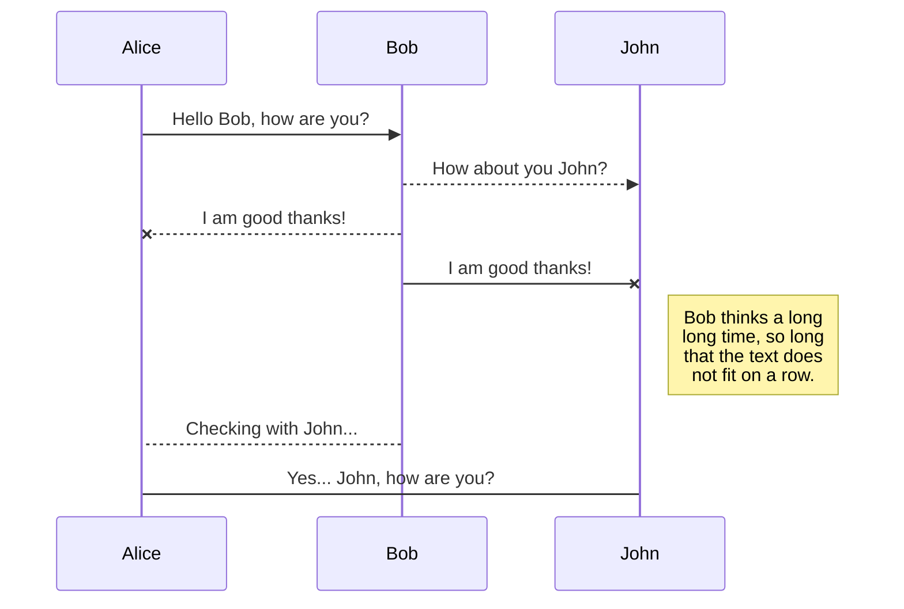
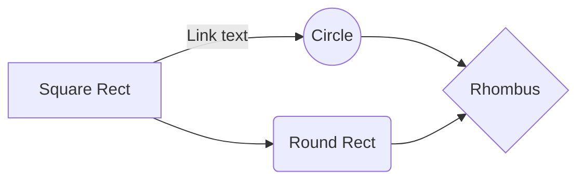

Primero debemos entender como funciona Github Pages (en adelante, GHP). GHP utiliza Jekyll el cual compila sitios web a a partir de Markdown (en adelante, MD).

## Workspace
Debemos configurar un espacio de trabajo, donde vamos a guardar nuestros documentos (en formato markdown) y plantillas Stackedit, por tanto, debe ser en un repositorio diferente al de Github `username/username.github.io` donde queremos publicar, ya que tendríamos un enredo de markdowns stackedit y jekyll del mismo nombre.
## Formato
Debemos entender que el formato en que GHP reconoce las páginas es el siguiente
```markdown
---
[Encabezados YAML]
---
[Markdown]
``` 
Por tal motivo necesitamos crear un plantilla, en mi caso llamada "Github pages" con la siguiente entrada:


```markdown
---  
{{{files.0.content.yamlProperties}}}  
---  
{{{files.0.content.text}}}
```
[[2]](#2)

Los valores `content.yamlProperties` son las metada del archivo (*File properties*) en formato YAML. El valor `content.text` simplemente entrega tal cual esta nuestro documento markdown de Stackedit.

Jekyll diferencia su cotenido entre *pages* y *posts* puesto que esta orientado a Blogging. Los *posts* tiene la particularidad de ser nombrados con la sintáxis `YEAR-MONTH-DAY-title.MARKUP` y ubicados en `/_posts/`. Además tienen metada imporante para una renderización efectiva como `date` , `categories` y `tags`.  Así un MD para GHP nombrado '2021-12-05-Welcome-to-Jekyll' se vería así:
```yaml
---
layout: post
title: "Welcome to Jekyll!"
date: 2021-12-05 03:13:22 -0500
categories: jekyll update
---
# Hi!
You’ll find this post in your `_posts` directory.
```
## Metadata
Los metadatos `tittle`, `date` , `categories` y `tags` están presentes en *File properties > Simple properties*, mas no `layout`, por tal motivo, necesitamos definirlo en *File properties > YAML properties*. El parámetro layout define la plantilla de `_layouts` del tema escogido con la cual vamos a renderizar. Debemos tener en cuenta que no todos lo temas de Jekyll para GHP tienen el layout `post`, en caso de utlizar un tema sin este layout simlpemenet nos sale la págine en blanco.

## Publish
En nuestro repositorio GHP creado, habremos definido la carpeta y rama de publicación, las cuales van a ser nuestros parámetros de publicación. Primero  en *publish*, autorizamos Stackedit en Github pero con una [pequeña pirueta](https://github.com/benweet/stackedit/issues/1755#issuecomment-918949789) para solventar el error HTTP 400. Luego en *publish* seleccionamos "Publish to Github" y definimos los siguientes parámetros:
 * El repositorio es la misma URL de clonación `https://github.com/username/username.github.io.git` no la de publicación `https://username.github.io.git`.
 * La ruta del archivo nos da el nombre final del archivo, para un post sería `_posts/AAAA-MM-DD-titulo.markdown`.
 * La rama cuyo valor por defecto es `master` no nos sirve porque Github ahora la llama `main` [[1]](#1)
 * La plantilla es "Github pages" que creamos previamente. 

## KaTeX

You can render LaTeX mathematical expressions using [KaTeX](https://khan.github.io/KaTeX/):

The *Gamma function* satisfying $\Gamma(n) = (n-1)!\quad\forall n\in\mathbb N$ is via the Euler integral

$$
\Gamma(z) = \int_0^\infty t^{z-1}e^{-t}dt\,.
$$

```math
SE = \frac{\sigma}{\sqrt{n}}
```

> You can find more information about **LaTeX** mathematical expressions [here](http://meta.math.stackexchange.com/questions/5020/mathjax-basic-tutorial-and-quick-reference).


## UML diagrams

You can render UML diagrams using [Mermaid](https://mermaidjs.github.io/). For example, this will produce a sequence diagram:



And this will produce a flow chart:


## Fuentes
* <a name="1">[1]<a/> https://www.zdnet.com/article/github-to-replace-master-with-alternative-term-to-avoid-slavery-references/
* <a name="2">[2]<a/> 
https://jekyllrb.com/docs/liquid/tags/#code-snippet-highlighting
> Written with [StackEdit](https://stackedit.io/).

