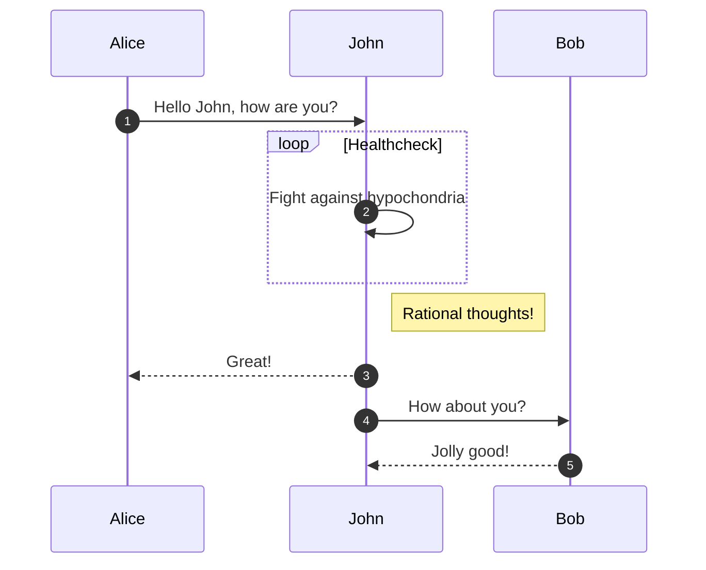

Github anunció en [un blog del 14 de febrero '21](https://github.blog/2022-02-14-include-diagrams-markdown-files-mermaid/) soporte para [Mermeaid](https://mermaid-js.github.io/mermaid/#/) en sus markdowns de sus reposistorios. Esto permite que el siguiente código de *Mermeaid* sea renderizado perfectamente en repositorios de Github
~~~markdown

~~~
Sin embargo, *Jekyll*, el cual es compilador de *Github Pages*, aún no tiene soporte para renderizar automáticamente el bloques como el de arriba. 
## Solución
Esto tiene una simple solución y es utilizar directamente la librería de mermaid en nuestro sitio Github. Un sitio web compilado con *Jekyll* utiliza *includes* que son simplemente fragmentos HTML, que es pueden reutilizar en los *layouts* que son plantillas HTML. Un caso en particular es el `_includes/head-custom.html` que está referenciado por la mayoria de temas de Jekyll-Github. Es en este archivo donde podemos incrustar scripts de Javascript como *Mermaid*. Así un parte del archivo luciría así:
```html
<script src="https://cdn.jsdelivr.net/npm/mermaid/dist/mermaid.min.js"></script>
<script>mermaid.initialize({startOnLoad:true});</script>
```
Con esto solo nos basta poner el markdown fuente de la página web eñ siguiente fragmento 
```html
<div class="mermaid">
sequenceDiagram
    autonumber
    Alice->>John: Hello John, how are you?
    loop Healthcheck
        John->>John: Fight against hypochondria
    end
    Note right of John: Rational thoughts!
    John-->>Alice: Great!
    John->>Bob: How about you?
    Bob-->>John: Jolly good!
</div>
```
y *Mermaid* se encargaría de renderizarlo como lo observamos a continuación:
<div class="mermaid">
sequenceDiagram
    autonumber
    Alice->>John: Hello John, how are you?
    loop Healthcheck
        John->>John: Fight against hypochondria
    end
    Note right of John: Rational thoughts!
    John-->>Alice: Great!
    John->>Bob: How about you?
    Bob-->>John: Jolly good!
</div>