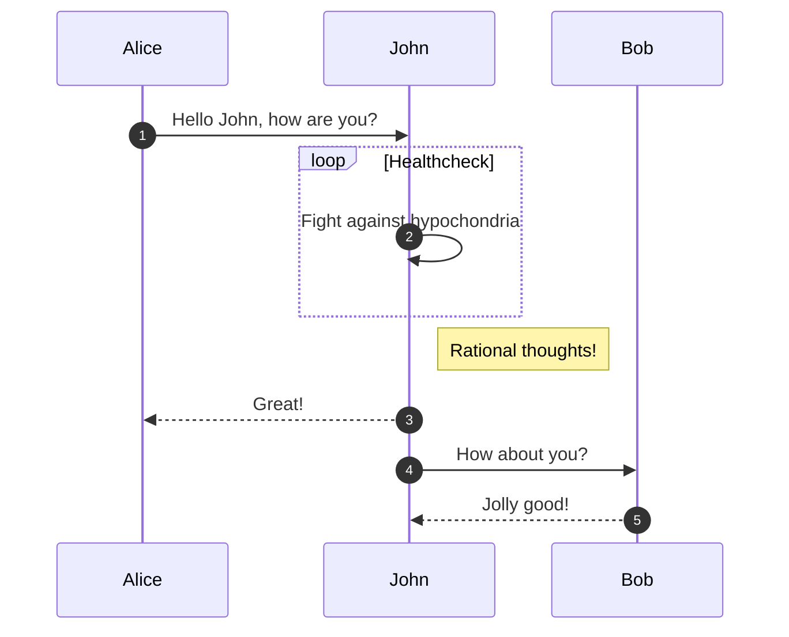

Github anunció en [un blog del 14 de febrero '21](https://github.blog/2022-02-14-include-diagrams-markdown-files-mermaid/) soporte para [Mermeaid](https://mermaid-js.github.io/mermaid/#/) en sus markdowns de sus repositorios por medio de sus bloques de código. Sin embargo, Jekyll, el compilador de *Github Pages* aún no renderiza los diagramas. Aća te contamos 2 soluciones para que tu sitio Github Page renderice diagramas Mermaid desde bloques de código markdown.
<!--more-->
La nueva compatibilidad de los repositorios de Github con bloques de código markdown para Mermaid permite que el siguiente código sea renderizado perfectamente en repositorios de Github
~~~markdown

~~~
Sin embargo, *Jekyll*, el cual es compilador de *Github Pages*, aún no tiene soporte para renderizar automáticamente el bloques como el de arriba. 
## Solución N°1:
La solución más simple es utilizar directamente la librería de mermaid en nuestro sitio Github. Un sitio web compilado con *Jekyll* utiliza *includes* que son simplemente fragmentos HTML, que se pueden reutilizar en los *layouts* que son plantillas HTML. Un caso en particular es el `_includes/head-custom.html` que está referenciado por la mayoria de temas de Jekyll-Github. Es en este archivo donde podemos incrustar scripts de Javascript como *Mermaid*. Así un parte del archivo luciría así:
```html
<script src="https://cdn.jsdelivr.net/npm/mermaid/dist/mermaid.min.js"></script>
<script>mermaid.initialize({startOnLoad:true});</script>
```
Con esto solo nos basta poner el markdown fuente de la página web eñ siguiente fragmento 
```html
<div class="mermaid">
sequenceDiagram
    autonumber
    Alice->>John: Hello John, how are you?
    loop Healthcheck
        John->>John: Fight against hypochondria
    end
    Note right of John: Rational thoughts!
    John-->>Alice: Great!
    John->>Bob: How about you?
    Bob-->>John: Jolly good!
</div>
```
y *Mermaid* se encargaría de renderizarlo como lo observamos a continuación:
<div class="mermaid">
sequenceDiagram
    autonumber
    Alice->>John: Hello John, how are you?
    loop Healthcheck
        John->>John: Fight against hypochondria
    end
    Note right of John: Rational thoughts!
    John-->>Alice: Great!
    John->>Bob: How about you?
    Bob-->>John: Jolly good!
</div>

## Solución N°2:
La segunda solución es ir poco mas allá de la solución N°1. Jekyll convierte los bloques de código "mermaid"

~~~markdown
```mermaid
```
~~~

en elementos html code

```html
<code class="language-mermaid"></code>
```

Por tanto la solución implica crear un script en `/assets/js/mermaid4MD.js`:
```javascript
document.addEventListener('DOMContentLoaded', function() {
    // Get code html tag from Mermaid
    const codeMermaid = document.querySelector("code.language-mermaid");
    const elParent = codeMermaid.parentNode;
    const codeText = codeMermaid.innerHTML;
    // Create div compatible with Mermaid.js
    var divMermaid = document.createElement("div");
    divMermaid.classList.add("mermaid");
    divMermaid.innerHTML = codeText;
    // Replace code with div
    elParent.replaceChild(divMermaid,codeMermaid);
}, false);
```

Y similar a la solución incluimos este script y el de mermaid en el encabezado personalizado de `_includes/head-custom.html`:
```html
<!-- Mermaid -->
<script src="https://cdn.jsdelivr.net/npm/mermaid/dist/mermaid.min.js"></script>
<script>mermaid.initialize({startOnLoad:true});</script>

<!-- Mermaid para Markdown code block-->
<script src="/assets/js/mermaid4MD.js"></script>
```

Así nuestro bloque de código se renderizará automáticamente. Compruebalo en el [código markdown fuente](https://github.com/FredyRosero/FredyRosero.github.io/blob/main/_posts/2022-02-21-Diagramas-en-Github-Page.md) de esta entrada
